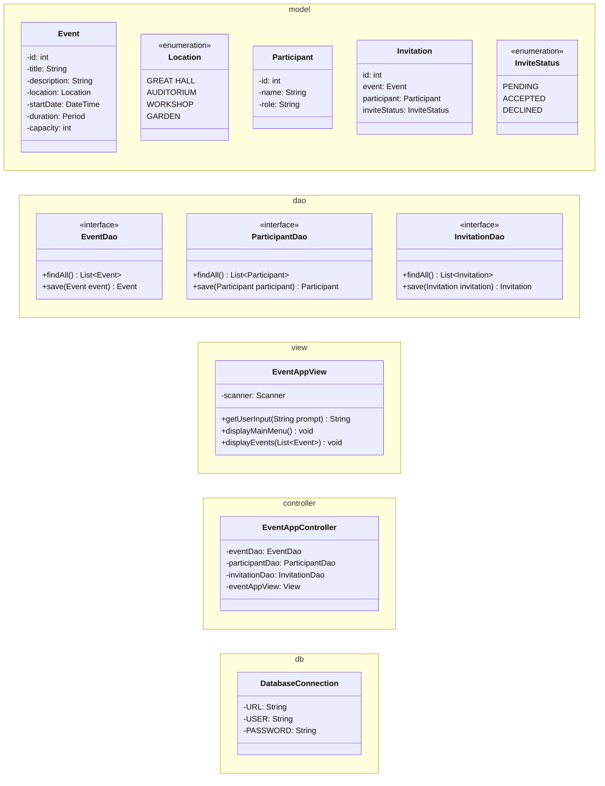

# Event Management App

Organize events for a community center. Staff members can create events and invite participants.

## Requirements
### Documentation
ReadMe file, UML Diagram, coding conventions and version control.

### Features
The application is managed through a console menu that store and load data using a database.
Each event has a title and description. Date and time range. A location and maximum capacity.
Participants can be individuals or represent a company or organization.
Invitations should have a status of pending, accepted or declined.

### User Interaction
The system allows users to create and manage events. Register participants, invite them to events and
update their invitation status. During creation of an event the organizer selects time, location,
capacity and may invite participants. The system provide views for upcoming events, participants
invited to an event, events a participant is invited to and list participants that accepted invitation to an event.

### Error Handling and Functionality
The system must ensure correct time range and capacity input for events. Prevent duplicate invitations and overbooking.

## UML Class Diagram

## Documentation
### Problem analysis and design choices.
**First thoughts:**  
The Model to contain Event, Location, Participant and InviteStatus classes for the basic building blocks.  
I give all the model classes their basic fields and methods.  
Data Access Objects to include the interface EventDao to handle communication with model objects.  
My first thought is to give this interface the methods save and findAll. But considering to give it a method  
that creates "Events" and give the method that saves Events to database to some other interface.  
DatabaseConnection for separate storage of connection information. Started implementing.

**After first implementation:**  
I decide to give Participant a separate DAO interface named ParticipantDao to keep classes focused.  
Now adding save and findAll methods to the DAOs like we did in previous workshops. I try and save an Event  
with only id and title to the database. I create the database in the mySQL Workbench App. Consider adding code later  
that adds databases and tables from the program if they don't exist. Then I realize that my model classes lack id  
in their fields and that. I give the event title to the method in hard code since I don't have a create event  
method yet. The Event is saved successfully.  
I consider where to store my create event and participant methods and decide to try the MVC design we used in earlier  
workshop. Now I add controller package with the class EventAppController and give it the run method that will be the  
main program loop. Then I add the view package with the class EventAppView and give it the first methods  
displayMainMenu and getUserINput. I start implementing.

**After second implementations:**  
I realize that it makes sense to create a separate class to represent Invitations. It will contain the InviteStatus  
enum in its field. And I create the InvitationDao too. Then add the tables participants and invitations to the  
database that already contains an app_events table. All tables only have the basic columns of id and or title and  
participant_name. My implementations of EventDaoImpl and ParticipantDaoImpl constructors currently have the  
parameter "Connection" like we learned in the JDBC lecture.

Attempted method overload of methods displayEvents(List<Event> events) and displayParticipants(List<Participant> participants).  
But that was not allowed by Java in a straightforward way.

### Program runtime Algorithm
Start  
Display Main Menu
1. Create new Event
2. Register Participant
3. View Events
4. View Participants
5. Exit

Option 1 Create new Event:  
Display Location Options  
1\. Great Hall 2. Auditorium 3. Workshop 4. Garden  
Input Location number  
Input Event details: Title, Description, StartDate, Duration and Capacity.  
Ask to invite participants Yes/No.  
Option No, Display Event Created Successfully. Return to Main Menu.  
Option Yes, Display Invite Participants Menu
Display a numbered list of All Registered Participants that are not invited to this Event.  
Input number for each participant to invite. Input 0 when finished.  
Display invitations sent Successfully. Return to Main Menu.

Option 2 Register Participant:  
Ask to input name or 0 to exit.  
Input name.  
Display role must be individual or name of organization.  
Input role.  
Display Participant Registered Successfully.  
Option 0 abort Registration and return to Main Menu.

Option 3 view Events:  
Display a numbered list of All Events with their Title and StartDate.  
Ask to input number of an Event to view or 0 to Exit.  
Input Event number.  
Display All Details of the selected Event.  
Display Event Menu
1. Invite Participants  
   Display Invite Participants Menu, see above description.
2. View All Attending Participants  
   Display a List of All Attending.
3. View All Invited Participants  
   Display a List of All Invited.
4. Exit  
   Return to Main Menu.

Option 4 View Participants:  
Display a numbered list of All Registered Participants with their name and role.  
Ask to input number of a Participant to view or 0 to Exit.  
Display Participant Menu
1. View Events Attending  
   Display a List of All Events the Participant is Attending.
2. View Event Invitations  
   Display a List of All Events the Participant is Invited to.
3. Exit  
   Return to Main Menu.

Option 5 Exit:  
Display Exit program.  
End  
