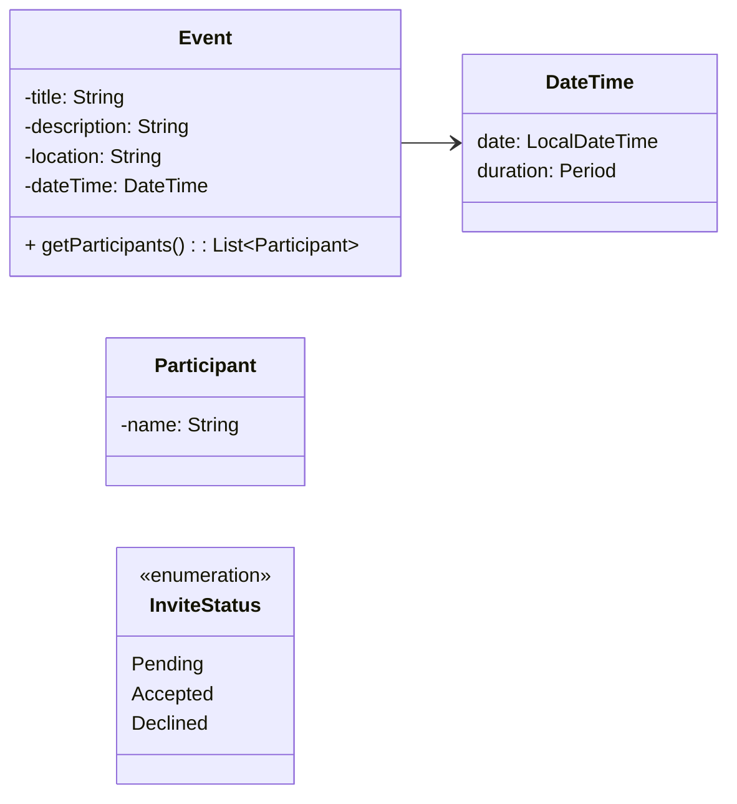

Start of Readme

Start of UML Class Diagram

```mermaid
classDiagram
    direction LR

    class Event {
        -title: String
        -description: String
        -location: String
        -dateTime: DateTime
        + getParticipants(): List~Participant~ 
    }
    
    class DateTime {
        date: LocalDateTime
        duration: Period
    }
    
    class Participant {
        -name: String
    }
    
    class InviteStatus {
        <<enumeration>>
        Pending
        Accepted
        Declined
 }
 
 Event --> DateTime
```
