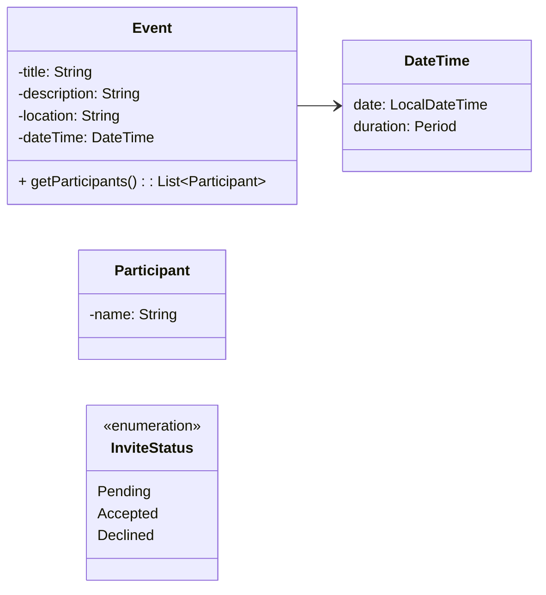

# Event Management App

Organize events for a community center. Staff members can create events and invite participants.

## Requirements
### Documentation
ReadMe file, UML Diagram, coding conventions and version control.

### Features
The application is managed through a console menu that store and load data using a database.
Each event has a title and description. Date and time range. A location and maximum capacity.
Participants can be individuals or representatives of a company or organization.
Invitations should have a status of pending, accepted or declined.

### User Interaction
The system allows users to register participants and invite them to events. Update the invitation status.
Create and manage events. During creation of an event the organizer selects time, location, capacity and may invite
participants. The system provide views for upcoming events, participants invited to an event, events a participant
is invited to and list participants that accepted invitation to an event.

### Error Handling and Functionality
The system must ensure correct time range and capacity input for events. Prevent duplicate invitations and overbooking.

## UML Class Diagram

## Documentation
# First problem analysis and design choices.
Model to contain Event, Participant and InviteStatus classes for the basic building blocks. Consider creating a separate
class for DateTime since it contains multiple variables. an event has both a starting date and a time period.
Consider extending Event class to make events share core features but separate specific features.

Data access objects

DatabaseConnection for separate storage of connection information.